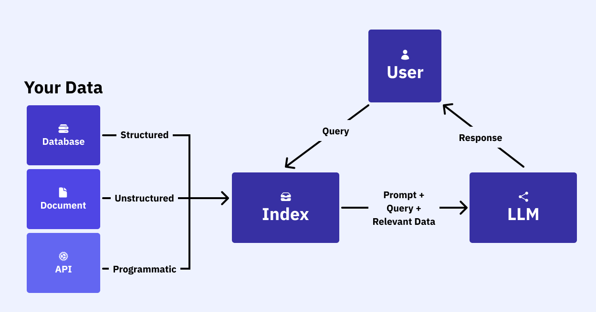

# Courses about RAG

[Learning Path on Cognitive Class](https://cognitiveclass.ai/learn/mastering-rag-build-smart-data-driven-application)

## Course #1: Summarize private documents using RAG, LangChain, and LLMs

* [Cognitive Class course #1](https://cognitiveclass.ai/courses/summarize-private-documents-using-rag-langchain-and-llms)
* Lab is done with [LangChain](https://python.langchain.com/docs/introduction/)

### What is RAG?

- retrieval-augmented generation
- augmented LLM knowledge with additional data: PDFs, websites, databases, APIs
- can be private data or public data after model's cut-off date

### RAG architecture

- two main components: indexing and retrieval & generation
- indexing:
  - pipeline for ingesting and indexing data from a source 
  - happens offline 
  - steps:
    - load the data with DocumentLoaders
    - split: break large documents into smaller chunks with TextSplitter
    - store: store and index the chunks for searching by VectorStore or Embeddings
- retrieval & generation:
  - RAG chain takes the user query and retrieves relevant information from index
  - passes both to the model
  - steps:
    - retrieve relevant splits from storage
    - generate a response by passing the question and retrieved splits to the LLM

### Course Lab

See [RAG course IBM notebook](notebooks/RAG-Course-IBM.ipynb)

## Course #2: RAG with LlamaIndex - Build a retrieval agent using LLMs

* [Cognitive Class course #2](https://cognitiveclass.ai/courses/rag-with-llamaindex-build-a-retrieval-agent-using-llms)
* Lab is done with [LlamaIndex](https://docs.llamaindex.ai/en/stable/)

### RAG stages

1. Loading:
   - bringing your data into the workflow
   - LlamaHub offers a wide range of connectors
2. Indexing:
   - creating a data structure for efficient querying
   - generate vector embeddings (= numerical representations that capture the meaning of the data)
   - plus metadata strategies to ensure accurate and contextually relevant data retrieval
3. Storing:
   - save index with associated metadata 
4. Querying:
   - multiple ways to utilize LLMs and LlamaIndex for querying
   - can include sub-queries, multi-step queries, hybrid approaches 
5. Evaluation:
   - essential stage
   - how effective is your approach compared to others or when adjustments are made
   - objective metrics to access accuracy, fidelity, speed

### Course Lab

See [RAG course IBM notebook](notebooks/RAG-course-IBM-LlamaIndex.ipynb)

## Course #3: Build a grounded Q/A Agent with Granite3, Langchain and RAG

* [Cognitive Class course #3](https://cognitiveclass.ai/courses/build-a-grounded-q-a-agent-with-langchain-granite-and-rag)
* Lab is done with [LangChain](https://python.langchain.com/docs/introduction/)

### Course Lab

See [RAG course IBM notebook](notebooks/RAG-course-IBM-question-answering.ipynb)

## Course #4: Build a RAG System for Web Data with LangChain and Llama 3.1

* [Cognitive Class course #4](https://cognitiveclass.ai/courses/build-a-rag-system-for-web-data-with-langchain-and-llama-3-1)
* Lab is done with [LangChain](https://python.langchain.com/docs/introduction/)

### Course Lab

See [RAG course IBM notebook](notebooks/RAG-course-IBM-webdata.ipynb)

## Course #5: YouTube Summarizer & Q&A Guide: Granite, RAG, and LangChain

* [Cognitive Class course #5](https://cognitiveclass.ai/courses/build-youtube-smart-summaries-and-q-a-with-langchain-and-rag)
* Lab is done with [LangChain](https://python.langchain.com/docs/introduction/)

### Course Lab

See [RAG course IBM notebook](notebooks/RAG-course-IBM-YouTube-Summarization.ipynb)

## Course #6: 

* [Cognitive Class #6](https://cognitiveclass.ai/courses/create-an-ai-icebreaker-bot-with-watsonx-and-llamaindex)
* Lab done with [LlamaIndex](https://docs.llamaindex.ai/en/stable/), [IBM watsonx](https://www.ibm.com/watsonx)

### Definitions

* Large language models:
  * are a type of artificial intelligence (AI) models that are trained on a large corpus of text data. LLMs are designed to generate human-like text responses to a wide range of questions. They are based on the Transformer architecture and are pretrained on a variety of language tasks to improve their performance.
* IBM watsonx:
  * is a suite of AI tools and services that are designed to help developers build and deploy AI-driven applications. watsonx provides a range of APIs and tools that make it easy to integrate AI capabilities into applications, including natural language processing, computer vision, and speech recognition.
* LlamaIndex:
  * is an open-source data orchestration platform for creating large language model (LLM) applications. LlamaIndex is accessible in Python and TypeScript, and it uses a set of tools and features to ease the context augmentation process for generative AI (gen AI) use cases via a Retrieval-Augmented (RAG) pipeline.
* RAG: see above
* Prompt Engineering
  * is the process of designing and refining the inputs (prompts) given to language models such as GPT to get desired outputs. It involves crafting questions, instructions, or context in a way that guides the model to generate accurate, relevant, or creative responses. Good prompt engineering can improve the quality, specificity, and usefulness of the generated text, making it a critical skill for leveraging large language models in various applications like chatbots, content generation, or data analysis.

## Own idea

Tutor:
- lessons with vocabularies filtered by unit
- lessons with grammar filtered by unit
- chat with the bot depending on the lessons before
- technology:
  - LangChain
  - HuggingFaceEmbeddings
  - RAG: csv with vocabularies, txt with grammar
